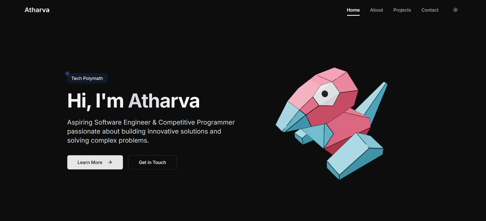

# **🚀 Personal Portfolio Website**  

A modern and interactive portfolio website built with **Next.js**, featuring **3D elements**, smooth animations, and real-time GitHub statistics.  

 

## **✨ Tech Stack**  

| Technology    | Purpose |
|--------------|---------|
| **Next.js**  | React framework for SSR & performance |
| **TypeScript** | Type safety for better development |
| **Tailwind CSS** | Utility-first styling framework |
| **Framer Motion** | Smooth animations & page transitions |
| **Three.js** | 3D graphics & elements |
| **Vercel** | Deployment & hosting |

---

## **🌟 Features**  

✔️ **Responsive design** (Mobile & Desktop)  
✔️ **Dark/Light theme support**  
✔️ **Real-time GitHub statistics** (Contributions, repos, etc.)  
✔️ **Project showcase with filtering**  
✔️ **Tech stack visualization**  
✔️ **Smooth page transitions** (Framer Motion)  
✔️ **Interactive 3D elements** (Three.js)  
✔️ **Contact form with email integration**  
✔️ **SEO optimized** (Meta tags, Open Graph, etc.)  

---

## **🛠️ Local Development**  

Clone the repository:  

```bash
git clone https://github.com/yourusername/your-portfolio.git
cd your-portfolio
```

Install dependencies:  

```bash
pnpm install
```

Run the development server:  

```bash
pnpm dev
```

🔗 Open [http://localhost:3000](http://localhost:3000) to see your portfolio in action!  

---

## **📁 Project Structure**  

```
.
├── app/              # Next.js app directory
├── components/       # Reusable React components
├── hooks/           # Custom React hooks
├── lib/             # Utility functions (API calls, helpers)
├── public/          # Static assets (images, icons, etc.)
└── styles/          # Global styles (Tailwind)
```

---

## **🔑 Environment Variables**  

Create a `.env.local` file in the root directory and add your GitHub token for fetching stats:  

```env
GITHUB_TOKEN=your_github_token
```

---

## **🚀 Deployment**  

Deploy your portfolio in seconds using [Vercel](https://vercel.com):  

1️⃣ Push your code to GitHub.  
2️⃣ Connect your repo to Vercel.  
3️⃣ Deploy with one click!  

🔗 **Live Demo:** [portfolio](https://atharva-works.vercel.app/about)

---

## **📜 License**  

This project is licensed under the **MIT License** – feel free to use and modify it!  

---

## **👨‍💻 Author**  

Made with ❤️ by **[Atharva](https://github.com/Atharva-Mendhulkar)**  

---
